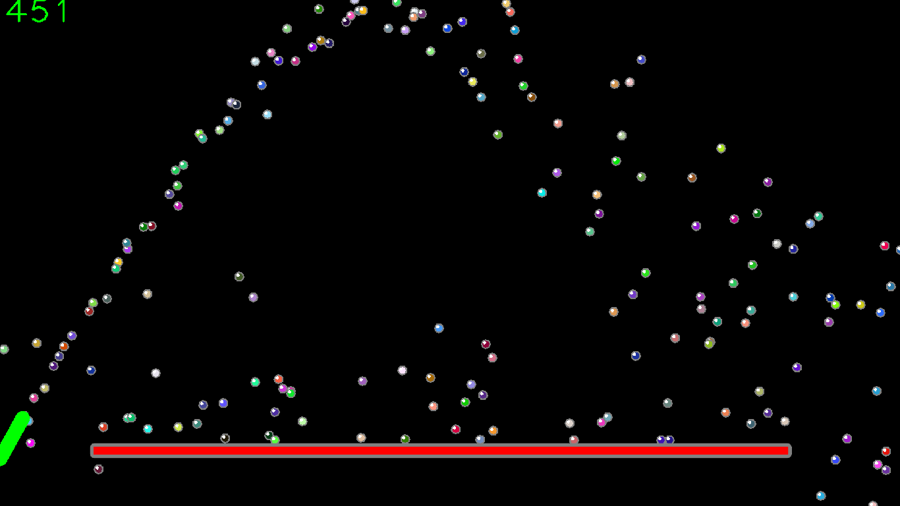

# stress_free
A game to release stress by see the colourful ball bounding the walls. User can move the turret up/down and shooting angles to adjust the balls' paths.
Also, this is an experiment to create a reinforcement learning environment for DQN. More work is required to make a flexible env for the agent to learn/ play.



## Required packages:
- Math
- NumPy
- OpenCV 3.4

## To run:
```python
python bounding_balls.py
```

## To control
- Press direction keys to move to the turret

- Press [s] to start/ stop shooting

### Future work

- [ ] An opponent ball to be added
- [ ] A scoring method
- [ ] Basic of deep Q learning using PyTorch
